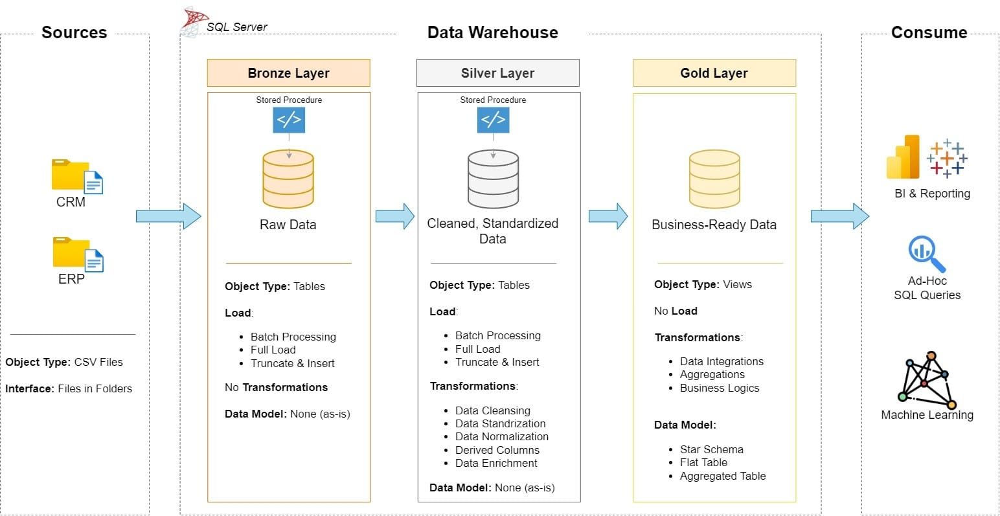
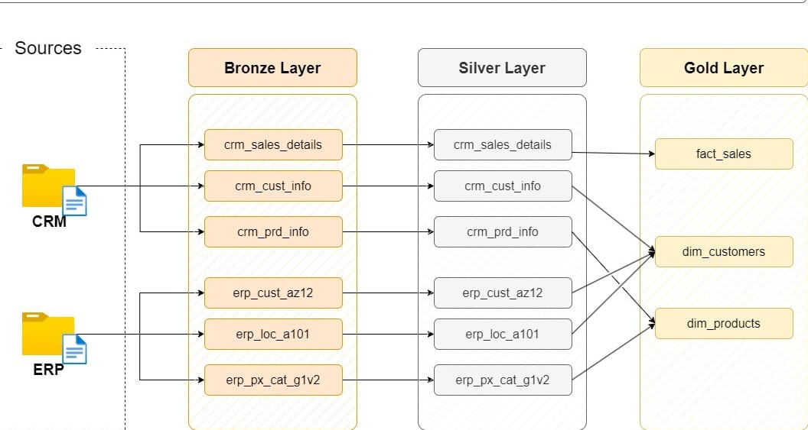
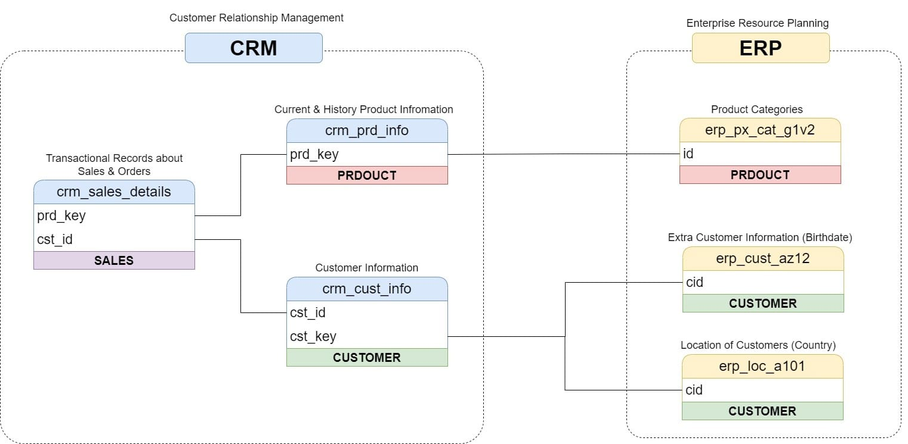
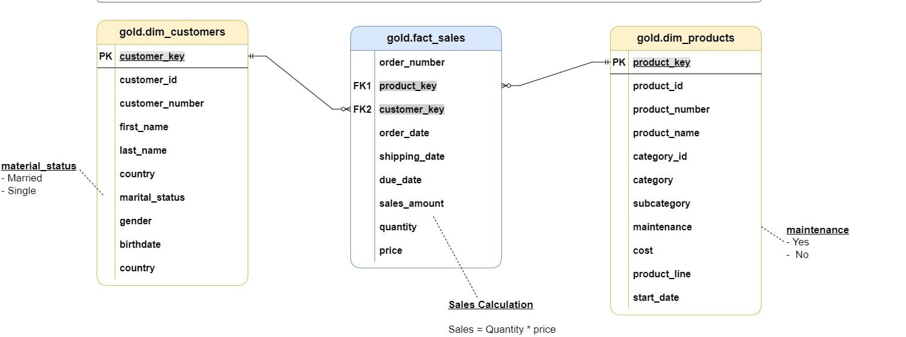

# SQL Data Warehouse and Analytics Project

## Project Overview

This project demonstrates the design and implementation of an end-to-end SQL Data Warehouse using the Medallion Architecture (Bronze, Silver, and Gold Layers).

The solution ingests raw data, performs data cleansing and transformation, and creates business-ready datasets for analytics and reporting.

## Tech Stack

- SQL Server
- T-SQL
- Data Warehouse Modeling
- ETL Development
- Data Analytics

## Architecture

## Data Flow

## Data Integration

## Sales Data Mart



### Bronze Layer
Stores raw source data.

### Silver Layer
Performs data cleansing, validation, and transformation.

### Gold Layer
Creates business-ready fact and dimension tables for reporting and analytics.

## Project Structure

```text
sql-data-warehouse-analytics/
├── bronze/
├── silver/
├── gold/
├── analytics/
├── screenshots/
├── datasets/
└── README.md
```

## Key Analytics

- Revenue Analysis
- Customer Segmentation
- Product Performance
- Sales Trends
- KPI Reporting

## Author

Akshay Sargar

